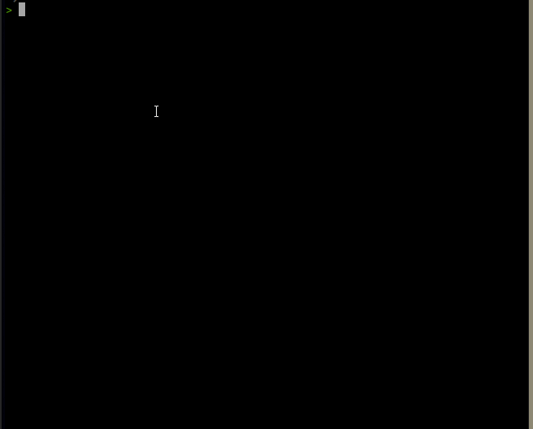

# UV meter


## What it does
uv.py is a simple tool that extracts UV Radiation index data from the Australian Radiation Protection and Nuclear Safety Agency (ARPNSA) [live data file](https://www.arpansa.gov.au/our-services/monitoring/ultraviolet-radiation-monitoring/ultraviolet-radation-data-information). 




## Limitations
* The script comes with absoultely **NO** gurantees. 
* This script was written over the course of a few hours. Treat it as such.
* The ARPNSA dataset is limited to a handful of stations in Australia. Their disclaimer can be found [here](https://www.arpansa.gov.au/our-services/monitoring/ultraviolet-radiation-monitoring/ultraviolet-radation-data-information#Disclaimer)
* Eachtime the script is run, it reds the ARPNSA live data file. So, *Please leave a gap of at least 5 seconds between subsequent calls*. 


## Installation
The script does not have any dependencies except python3. 
The script was tested on python 3.8.5 on Ubuntu. Theoritically it should work on any OS with a python3 installation. 
**To run uv.py simply copy the uv.py to your computer.**

## Getting help

```
> python uv.py -h
usage: uv.py [-h] [--list] [--all] [--detailed] [--loc LOC] [--map]

Shown the current UV index for the given location. UV observations courtesy of ARPANSA

optional arguments:
  -h, --help  show this help message and exit
  --list      List all locations together with their operational status
  --all       Show data for all locations.
  --detailed  Show all available stats. Use with --loc
  --loc LOC   Location for the UV readout. (Use --list for a list of locations).
  --map       Shows the UVR indexes of the capital cities in Australia.
```
  
  
## Listing available locations

```
python uv.py --list
```
This command will list all available locations together with their current status. 

```
  > python uv.py --list
loading data ...
----------------------------------
UV meter locations
----------------------------------
|  Adelaide  [ ok ]
|  Alice Springs  [ ok ]
|  Brisbane  [ ok ]
|  Canberra  [ ok ]
|  Casey  [ ok ]
|  Darwin  [ ok ]
|  Davis  [ ok ]
|  Emerald  [ ok ]
|  Gold Coast  [ ok ]
|  Kingston  [ ok ]
|  Macquarie Island  [ ok ]
|  Mawson  [ ok ]
|  Melbourne  [ ok ]
|  Newcastle  [ ok ]
|  Perth  [ ok ]
|  Sydney  [ ok ]
|  Townsville  [ ok ]
----------------------------------
```
## Getting UV index of a city

```
> python uv.py --loc Brisbane
UVR =  0.0 [ LOW  ]
Measured 1 min ago.
UV observations courtesy of ARPANSA.
```

For more details you can use the `--detailed` flag.
```
> python uv.py --loc Brisbane --detailed
|========================================| 
| Classification:  LOW 
| UV Index: 0.0
| Location: Brisbane
| Date: 6/03/2022
| Time: 9:18 PM
| UTCdatetime: 2022/03/06 11:18
| Measured 2 minutes ago
| Status: ok
| UV observations courtesy of ARPANSA.
|========================================|

```
## Displaying data in a map

```
python uv.py --map
```
This command will show the UV Radiation indexes of the capital cities of Australia.
(These docs were written at night so the UV index values are all 0s.)


```
> python uv.py --map


                    _,__        .:
               0.0  <*  /        | \
               .-./     |.     :  :,
              /           '-._/     \_
             /                '       \
           .'      UV Radiation        *: 0.0 
        .-'            of               ;
        |           AUSTRALIA           |
        \                              /
         |                            /
     0.0   \*        __.--._         */ 0.0 
           \     _.'    0.0  \*.      *| 0.0 
           >__,-'             \_/*_.-'
                                0.0 
                                :--,
                                 '/


```
## Showing all data
(These docs were written at night so the UV index values are all 0s.)
```
> python uv.py --all
UVR in  Adelaide is 0.0 [ LOW  ] Measured 2 min ago.
UVR in  Alice Springs is 0.0 [ LOW  ] Measured 2 min ago.
UVR in  Brisbane is 0.0 [ LOW  ] Measured 1 min ago.
UVR in  Canberra is 0.0 [ LOW  ] Measured 1 min ago.
UVR in  Casey is 0.0 [ LOW  ] Measured 1 min ago.
UVR in  Darwin is 0.0 [ LOW  ] Measured 1 min ago.
UVR in  Davis is 0.7 [ LOW  ] Measured 1 min ago.
UVR in  Emerald is 0.0 [ LOW  ] Measured 1 min ago.
UVR in  Gold Coast is 0.0 [ LOW  ] Measured 1 min ago.
UVR in  Kingston is 0.0 [ LOW  ] Measured 1 min ago.
UVR in  Macquarie Island is 0.0 [ LOW  ] Measured 1 min ago.
UVR in  Mawson is 1.0 [ LOW  ] Measured 1 min ago.
UVR in  Melbourne is 0.0 [ LOW  ] Measured 1 min ago.
UVR in  Newcastle is 0.0 [ LOW  ] Measured 1 min ago.
UVR in  Perth is 0.0 [ LOW  ] Measured 1 min ago.
UVR in  Sydney is 0.0 [ LOW  ] Measured 1 min ago.
UVR in  Townsville is 0.0 [ LOW  ] Measured 1 min ago.
UV observations courtesy of ARPANSA.
```


